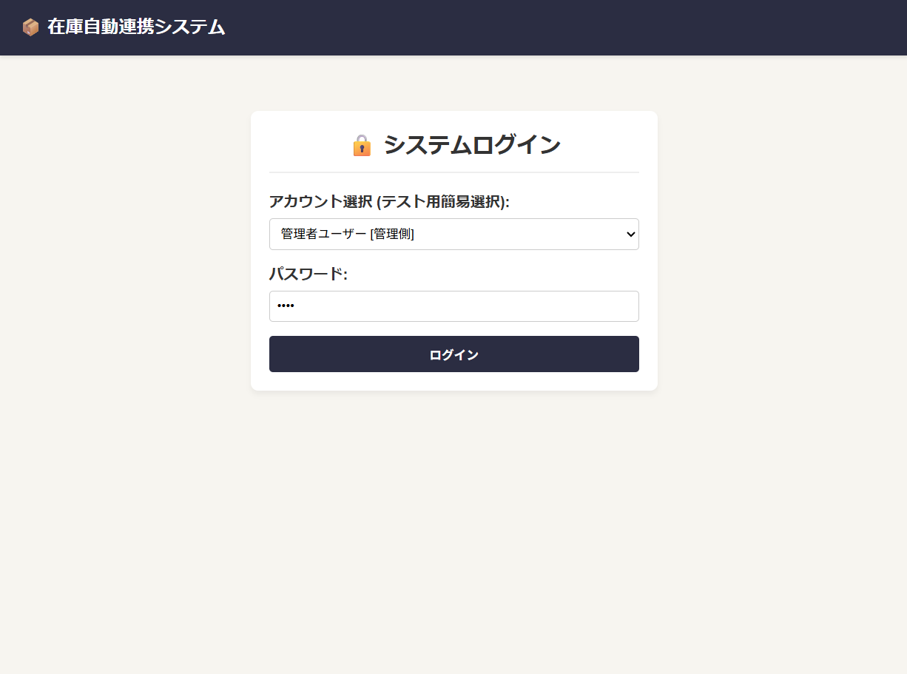
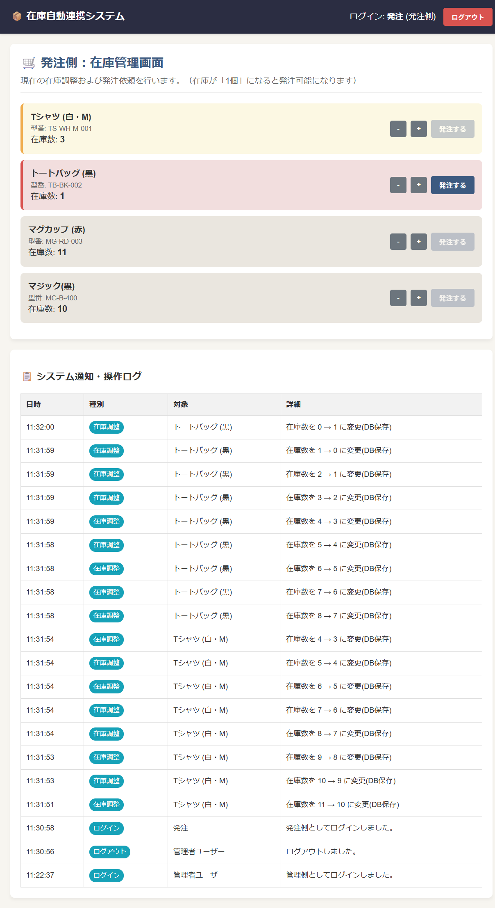
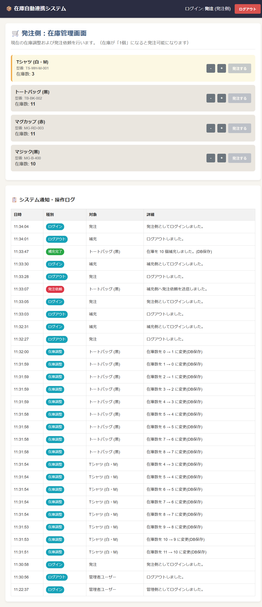
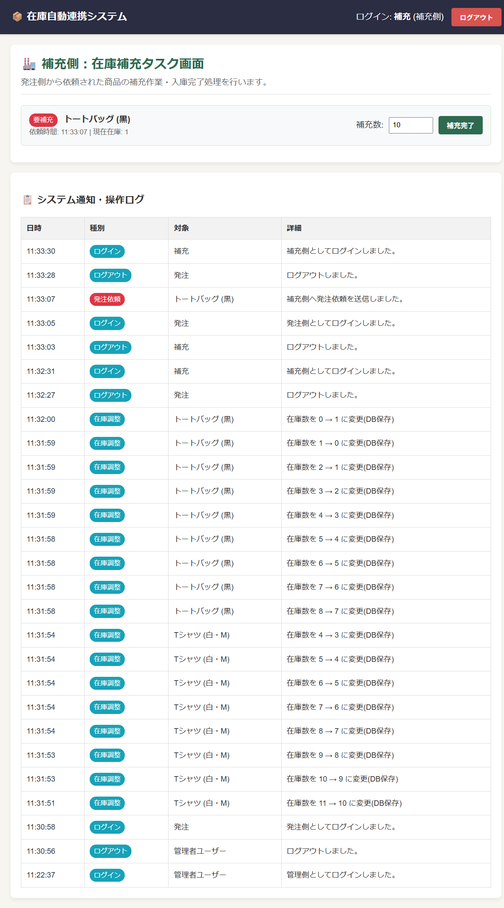
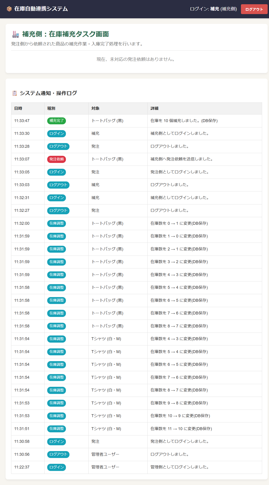
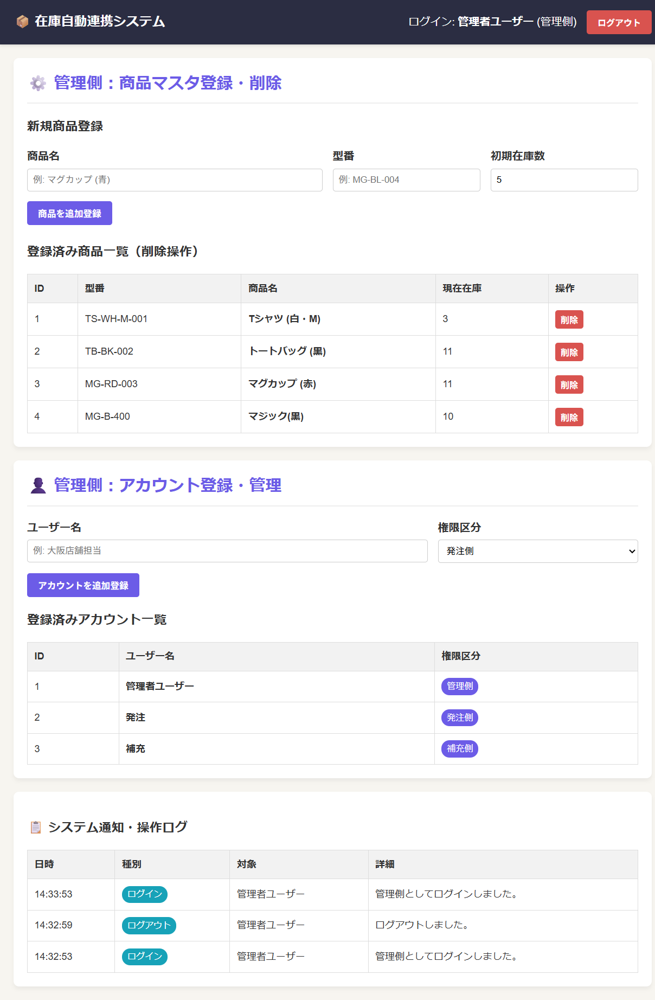

# docs
# 在庫自動連携システム (Zaiko Auto-Sync System)

複数の役割（発注側・補充側・管理者）間で在庫状況とタスクをリアルタイムに連動・一元管理するWebアプリケーションです。

---

## 画面ギャラリー & 主要機能

### 1. ログイン画面 (権限認証)
ロール（管理者 / 発注側 / 補充側）を選択してログインすることで、各権限に応じた専用画面に切り替わります。

---

### 2. 発注側画面 (在庫調整 & 発注自動制御)
在庫数が「1個」になると「発注する」ボタンが自動で有効化し、補充完了後はリアルタイムに在庫数が反映されます。

| 在庫注意・発注可能状態 | 補充完了後のリアルタイム反映 |
| :---: | :---: |
|  |  |

---

### 3. 補充側画面 (タスク管理 & 入庫処理)
発注側からの依頼がリアルタイムでタスク一覧に反映され、補充処理を行うと即座に在庫に加算されます。

| 補充タスク受信時 | 補充完了後 |
| :---: | :---: |
|  |  |

---

### 4. 管理側画面 (マスタ・ユーザー管理)
商品マスタの登録・削除、およびシステム利用ユーザーの権限管理を行います。画面下部には全操作のログが表示されます。

